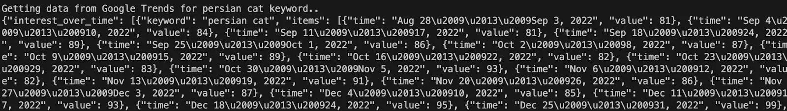

# How to Scrape Google Trends Data With Python

This article provides step-by-step instructions on how to get Google Trends data with Python and [SERP Scraper API](https://oxylabs.io/products/scraper-api/serp), which requires a **paid subscription** or a **free trial**.


## Why scrape Google Trends data?
Here are some of the uses for scraped Google Trends data:

- **Keyword research:** Google Trends is widely used among SEO specialists and content marketers. Since it provides insights into the past and present popularity of search terms, these professionals can tailor their marketing strategies to gain more website traffic.

- **Market research:** Google Trends data can be used for market research, helping businesses understand consumer interests and preferences over time. For example, e-commerce businesses can use Google Trends search insights for product development.

- **Societal research:** Google Trends website is a valuable resource for journalists and researchers, offering a glimpse into societal trends and public interest in specific topics.

These are just a few examples. Google Trends data can also help with investment decisions, brand reputation monitoring, and other cases.

## 1. Install libraries

For this guide, you'll need the following:
- Credentials for [SERP Scraper API](https://oxylabs.io/products/scraper-api/serp) – you can claim a **7-day free trial** by registering on the [dashboard](https://dashboard.oxylabs.io/en/);
- [Python](https://www.python.org/downloads/);
- [Requests](https://requests.readthedocs.io/en/latest/) library to make requests;
- [Pandas](https://pandas.pydata.org/docs/index.html) library to manipulate received data.

Open your terminal and run the following `pip` command:
```bash
pip install requests pandas
```

Then, import these libraries in a new Python file:

```python
import requests
import pandas as pd
```

## 2. Send a request

Let’s begin with building an initial request to the API:

```python
import requests
from pprint import pprint

USERNAME = "YourUsername"
PASSWORD = "YourPassword"

query = "persian cat"

print(f"Getting data from Google Trends for {query} keyword..")

url = "https://realtime.oxylabs.io/v1/queries"
auth = (USERNAME, PASSWORD)

payload = {
       "source": "google_trends_explore",
       "query": query,
}

try:
    response = requests.request("POST", url, auth=auth, json=payload, timeout=180)
except requests.exceptions.RequestException as e:
    print("Caught exception while getting trend data")
    raise e

data = response.json()
content = data["results"][0]["content"]
pprint(content)
```

For more information about possible parameters, check our [documentation](https://developers.oxylabs.io/scraper-apis/serp-scraper-api/google/trends-explore).

If everything’s in order, when you run the code, you should see the raw results of the query in the terminal window like this:


## 3. Save results to CSV

Now that you have the results, adjust the formatting and save in the CSV format – this way, it’ll be easier to analyze the data. All this can be done with the help of the `pandas` Python library.

The response you get from the API provides you with four categories of information: `interest_over_time`, `breakdown_by_region`, `related_topics`, and `related_queries`. Let’s split each category into its own separate CSV file. 

Begin by converting each into a `pandas` dataframe:
```python
def flatten_topic_data(topics_data: List[dict]) -> List[dict]:
   """Flattens related_topic data"""
   topics_items = []
   for item in topics_data[0]["items"]:
       item_dict = {
           "mid": item["topic"]["mid"],
           "title": item["topic"]["title"],
           "type": item["topic"]["type"],
           "value": item["value"],
           "formatted_value": item["formatted_value"],
           "link": item["link"],
           "keyword": topics_data[0]["keyword"],
       }
       topics_items.append(item_dict)

   return topics_items

trend_data = json.loads(content)
print("Creating dataframes..")

   # Interest over time
iot_df = pd.DataFrame(trend_data["interest_over_time"][0]["items"])
iot_df["keyword"] = trend_data["interest_over_time"][0]["keyword"]

   # Breakdown by region
bbr_df = pd.DataFrame(trend_data["breakdown_by_region"][0]["items"])
bbr_df["keyword"] = trend_data["breakdown_by_region"][0]["keyword"]

   # Related topics
rt_data = flatten_topic_data(trend_data["related_topics"])
rt_df = pd.DataFrame(rt_data)

   # Related queries
rq_df = pd.DataFrame(trend_data["related_queries"][0]["items"])
rq_df["keyword"] = trend_data["related_queries"][0]["keyword"]
```

As the data for `related_topics` is multi-leveled, you'll have to flatten the structure into a single-leveled one. Thus, the function `flatten_topic_data` was added to do so. 

The only thing left is to save the data to a file:
```python
CSV_FILE_DIR = "./csv/"

keyword = trend_data["interest_over_time"][0]["keyword"]
   keyword_path = os.path.join(CSV_FILE_DIR, keyword)
   try:
       os.makedirs(keyword_path, exist_ok=True)
   except OSError as e:
       print("Caught exception while creating directories")
       raise e

   print("Dumping to csv..")
   iot_df.to_csv(f"{keyword_path}/interest_over_time.csv", index=False)
   bbr_df.to_csv(f"{keyword_path}/breakdown_by_region.csv", index=False)
   rt_df.to_csv(f"{keyword_path}/related_topics.csv", index=False)
   rq_df.to_csv(f"{keyword_path}/related_queries.csv", index=False)
```
You’ve now created a folder structure to hold all of your separate CSV files grouped by keyword:


## 4. Create a result comparison
Let’s begin with multiple keyword handling. To make the code iterable, split it into reusable functions.

First, extract the code for the request to the API into a function that takes a query as an argument and returns you the response:

```python
def get_trend_data(query: str) -> dict:
   """Gets a dictionary of trends based on given query string from Google Trends via SERP Scraper API"""
   print(f"Getting data from Google Trends for {query} keyword..")
   url = "https://realtime.oxylabs.io/v1/queries"
   auth = (USERNAME, PASSWORD)
   payload = {
       "source": "google_trends_explore",
       "query": query,
   }
   try:
       response = requests.request("POST", url, auth=auth, json=payload)
   except requests.exceptions.RequestException as e:
       print("Caught exception while getting trend data")
       raise e

   data = response.json()
   content = data["results"][0]["content"]
   return json.loads(content)
```
Next, you need a function that would transform a raw response into `pandas` dataframes, save said dataframes as CSV files, and return them:
```python
def dump_trend_data_to_csv(trend_data: dict) -> dict:
   """Dumps given trend data to generated CSV file"""
   CSV_FILE_DIR = "./csv/"
   # Interest over time
   print("Creating dataframes..")
   iot_df = pd.DataFrame(trend_data["interest_over_time"][0]["items"])
   iot_df["keyword"] = trend_data["interest_over_time"][0]["keyword"]

   # Breakdown by region
   bbr_df = pd.DataFrame(trend_data["breakdown_by_region"][0]["items"])
   bbr_df["keyword"] = trend_data["breakdown_by_region"][0]["keyword"]

   # Related topics
   rt_data = flatten_topic_data(trend_data["related_topics"])
   rt_df = pd.DataFrame(rt_data)

   # Related queries
   rq_df = pd.DataFrame(trend_data["related_queries"][0]["items"])
   rq_df["keyword"] = trend_data["related_queries"][0]["keyword"]

   keyword = trend_data["interest_over_time"][0]["keyword"]
   keyword_path = os.path.join(CSV_FILE_DIR, keyword)
   try:
       os.makedirs(keyword_path, exist_ok=True)
   except OSError as e:
       print("Caught exception while creating directories")
       raise e

   print("Dumping to csv..")
   iot_df.to_csv(f"{keyword_path}/interest_over_time.csv", index=False)
   bbr_df.to_csv(f"{keyword_path}/breakdown_by_region.csv", index=False)
   rt_df.to_csv(f"{keyword_path}/related_topics.csv", index=False)
   rq_df.to_csv(f"{keyword_path}/related_queries.csv", index=False)

   result_set = {}
   result_set["iot"] = iot_df
   result_set["bbr"] = bbr_df
   result_set["rt"] = rt_df
   result_set["rq"] = rq_df

   return result_set
```
Now that the request and dataframe creation is covered, you can create comparisons:

```python
def create_comparison(trend_dataframes : dict) -> None:
   comparison = trend_dataframes[0]
   i = 1

   for df in trend_dataframes[1:]:
       comparison["iot"] = pd.merge(comparison["iot"], df["iot"], on="time", suffixes=("", f"_{i}"))
       comparison["bbr"] = pd.merge(comparison["bbr"], df["bbr"], on="geo_code", suffixes=("", f"_{i}"))
       comparison["rt"] = pd.merge(comparison["rt"], df["rt"], on="title", how="inner", suffixes=("", f"_{i}"))
       comparison["rq"] = pd.merge(comparison["rq"], df["rq"], on="query", how="inner", suffixes=("", f"_{i}"))
       i = i + 1

   comparison["iot"].to_csv("comparison_interest_over_time.csv", index=False)
   comparison["bbr"].to_csv("comparison_breakdown_by_region.csv", index=False)
   comparison["rt"].to_csv("comparison_related_topics.csv", index=False)
   comparison["rq"].to_csv("comparison_related_queries.csv", index=False)
```
This function will accept the dataframes for all the queries you have created, go over them, and merge them for comparison on key metrics.

The last thing to do is to create the core logic of your application. Adding it all together, the final version of the code should look like this: 

```python
import json
import os
from typing import List

import pandas as pd
import requests

def get_trend_data(query: str) -> dict:
   """Gets a dictionary of trends based on given query string from Google Trends via SERP Scraper API"""

   USERNAME = "yourUsername"
   PASSWORD = "yourPassword"
   print(f"Getting data from Google Trends for {query} keyword..")
   url = "https://realtime.oxylabs.io/v1/queries"
   auth = (USERNAME, PASSWORD)
   payload = {
       "source": "google_trends_explore",
       "query": query,
   }
   try:
       response = requests.request("POST", url, auth=auth, json=payload)
   except requests.exceptions.RequestException as e:
       print("Caught exception while getting trend data")
       raise e

   data = response.json()
   content = data["results"][0]["content"]
   return json.loads(content)


def flatten_topic_data(topics_data: List[dict]) -> List[dict]:
   """Flattens related_topic data"""
   topics_items = []
   for item in topics_data[0]["items"]:
       item_dict = {
           "mid": item["topic"]["mid"],
           "title": item["topic"]["title"],
           "type": item["topic"]["type"],
           "value": item["value"],
           "formatted_value": item["formatted_value"],
           "link": item["link"],
           "keyword": topics_data[0]["keyword"],
       }
       topics_items.append(item_dict)

   return topics_items


def dump_trend_data_to_csv(trend_data: dict) -> dict:
   """Dumps given trend data to generated CSV file"""
   CSV_FILE_DIR = "./csv/"
   # Interest over time
   print("Creating dataframes..")
   iot_df = pd.DataFrame(trend_data["interest_over_time"][0]["items"])
   iot_df["keyword"] = trend_data["interest_over_time"][0]["keyword"]

   # Breakdown by region
   bbr_df = pd.DataFrame(trend_data["breakdown_by_region"][0]["items"])
   bbr_df["keyword"] = trend_data["breakdown_by_region"][0]["keyword"]

   # Related topics
   rt_data = flatten_topic_data(trend_data["related_topics"])
   rt_df = pd.DataFrame(rt_data)

   # Related queries
   rq_df = pd.DataFrame(trend_data["related_queries"][0]["items"])
   rq_df["keyword"] = trend_data["related_queries"][0]["keyword"]

   keyword = trend_data["interest_over_time"][0]["keyword"]
   keyword_path = os.path.join(CSV_FILE_DIR, keyword)
   try:
       os.makedirs(keyword_path, exist_ok=True)
   except OSError as e:
       print("Caught exception while creating directories")
       raise e

   print("Dumping to csv..")
   iot_df.to_csv(f"{keyword_path}/interest_over_time.csv", index=False)
   bbr_df.to_csv(f"{keyword_path}/breakdown_by_region.csv", index=False)
   rt_df.to_csv(f"{keyword_path}/related_topics.csv", index=False)
   rq_df.to_csv(f"{keyword_path}/related_queries.csv", index=False)

   result_set = {}
   result_set["iot"] = iot_df
   result_set["bbr"] = bbr_df
   result_set["rt"] = rt_df
   result_set["rq"] = rq_df

   return result_set

def create_comparison(trend_dataframes : dict) -> None:
   comparison = trend_dataframes[0]
   i = 1

   for df in trend_dataframes[1:]:
       comparison["iot"] = pd.merge(comparison["iot"], df["iot"], on="time", suffixes=("", f"_{i}"))
       comparison["bbr"] = pd.merge(comparison["bbr"], df["bbr"], on="geo_code", suffixes=("", f"_{i}"))
       comparison["rt"] = pd.merge(comparison["rt"], df["rt"], on="title", how="inner", suffixes=("", f"_{i}"))
       comparison["rq"] = pd.merge(comparison["rq"], df["rq"], on="query", how="inner", suffixes=("", f"_{i}"))
       i = i + 1

   comparison["iot"].to_csv("comparison_interest_over_time.csv", index=False)
   comparison["bbr"].to_csv("comparison_breakdown_by_region.csv", index=False)
   comparison["rt"].to_csv("comparison_related_topics.csv", index=False)
   comparison["rq"].to_csv("comparison_related_queries.csv", index=False)

def main():
   keywords = ["cat", "cats"]

   results = []

   for keyword in keywords:
       trend_data = get_trend_data(keyword)
       df_set = dump_trend_data_to_csv(trend_data)
       results.append(df_set)

   create_comparison(results)

if __name__ == "__main__":
   main()
```

Running the code will create comparison CSV files that have the combined information of the supplied keywords on each of the categories:

- `interest_over_time`

- `breakdown_by_region`

- `related_topics`

- `related_queries`


